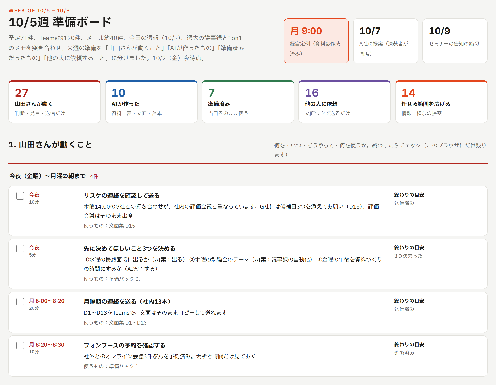

# week-prep：来週の準備をAIに先にやってもらうスキル（Claude Code・Codex用）

金曜の夜に、来週金曜までの仕事の下準備を、AIエージェントに先回りで終わらせてもらうためのスキルです。

来週の予定・チャット・メール・社内の資料をAIが読み、予定ごとに必要な準備（資料、メールやチャットの文面、リスケの連絡、会議室の予約リストなど）を先に作ります。最後に、来週の全体を1枚の「準備ボード」にまとめます。

ボードは次の5つに分かれます。

- あなたが動くこと（判断・発言・送信など、あなたにしかできないこと）
- AIが作ったもの
- 事前に準備されていたもの
- 他の人に依頼すること（そのまま送れる文面つき）
- AIに任せる範囲を広げる提案



## 必要なもの

- Claude Code または Codex
- 予定・チャット・メールなどを読むためのつながり（どれか1つからでも使えます）
  - 例：Microsoft 365（Outlook・Teams・SharePoint）、Google Workspace（Gmail・カレンダー・ドライブ）、Slack、Notion など
  - Claude Codeなら claude.ai のコネクタやMCPサーバー、CodexならMCPサーバーでつなぎます。何もつながっていなくても、来週の予定を貼り付ければ動きます
- Python 3（ボードのHTMLを組み立てるのに使います。なければAIが別の方法で作ります）

会社の情報をAIに読ませる前に、社内のAI利用のルールを確認してください。

## 入れ方

1. このリポジトリをZIPでダウンロードします（GitHubの「Code」→「Download ZIP」）
2. ZIPファイルを置いたフォルダでClaude Code（またはCodex）を開き、こう伝えます

   > ダウンロードしたZIPのスキルを入れて、セットアップをお願いします

   AIが、ZIPの中の `INSTALL_FOR_AI.md` に沿って `week-prep` フォルダをスキルの置き場所にコピーし、初回のセットアップを始めます。

自分で入れる場合は、`week-prep` フォルダを次の場所に置いてください（`~` はホームフォルダ。Windowsなら `C:\Users\<あなた>`）。

| | どのフォルダで開いても使う | このプロジェクトだけで使う |
|---|---|---|
| Claude Code | `~/.claude/skills/week-prep/` | `<プロジェクト>/.claude/skills/week-prep/` |
| Codex | `~/.agents/skills/week-prep/` | `<プロジェクト>/.agents/skills/week-prep/` |

## 使い方

- 初回：「来週の準備をして」と頼むと、まずセットアップが始まります。AIが、つながっているツールを確認し、あなたの名前・役割・任せたい仕事・社内の人の呼び方などを質問して、`week-prep/my-profile.md` を作ります
- 2回目から：「来週の準備をして」の一言で、準備ボードができあがり、ブラウザで開きます（Claude Codeなら `/week-prep` でも呼べます）
- 文面の呼び方や口調を直したら、AIが `my-profile.md` に反映して、次の週から同じ間違いをしなくなります

出力は、既定で作業中のフォルダの `week-prep-output/<来週の月曜の日付>/` に保存されます。

## 安全のために

- このスキルは、メールやチャットの送信、投稿、予定の作成・変更をしません。AIが作るのは、資料・文面・準備ボードまでです。送るかどうかは、あなたが決めます
- 会議室の予約やメールの下書き作成などをAIに任せたい場合は、セットアップで「許可している操作」に書いた範囲だけで行います
- `my-profile.md` には、呼び方や口調の特徴だけを書き、メッセージの本文は残しません

## 中身

```
week-prep/
  SKILL.md                      スキル本体（手順と守ること）
  references/setup.md           初回セットアップ
  references/collect.md         情報の集め方
  references/classify-and-make.md  仕分け方と、予定ごとの作り方
  references/board-data.md      ボードのデータ形式
  assets/board-template.html    ボードの雛形
  assets/sample-board-data.json 見本のデータ（架空の会社・人物）
  assets/profile-template.md    my-profile.md の雛形
  scripts/build_board.py        ボードを組み立てるスクリプト
INSTALL_FOR_AI.md               Claude Code・Codex向けの導入手順
```

## 作った人

青木晃一（株式会社NINAE）。仕組みの紹介はnoteの記事「仕事をAIネイティブに変える一番の方法」に書いています。
